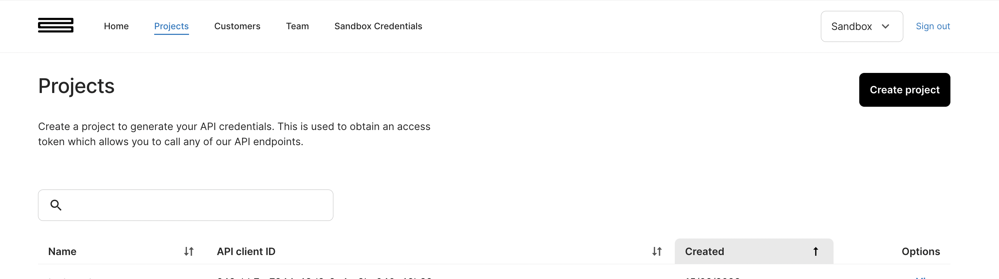
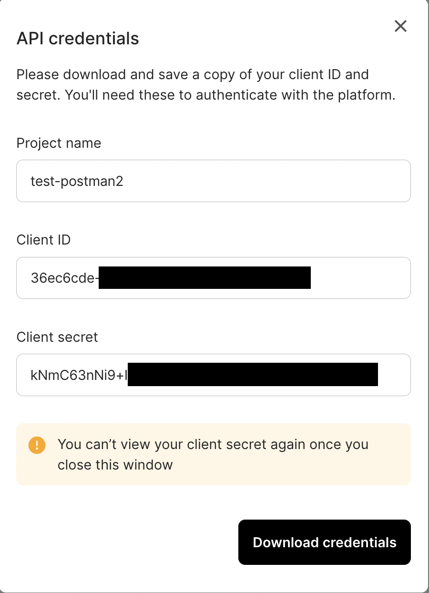
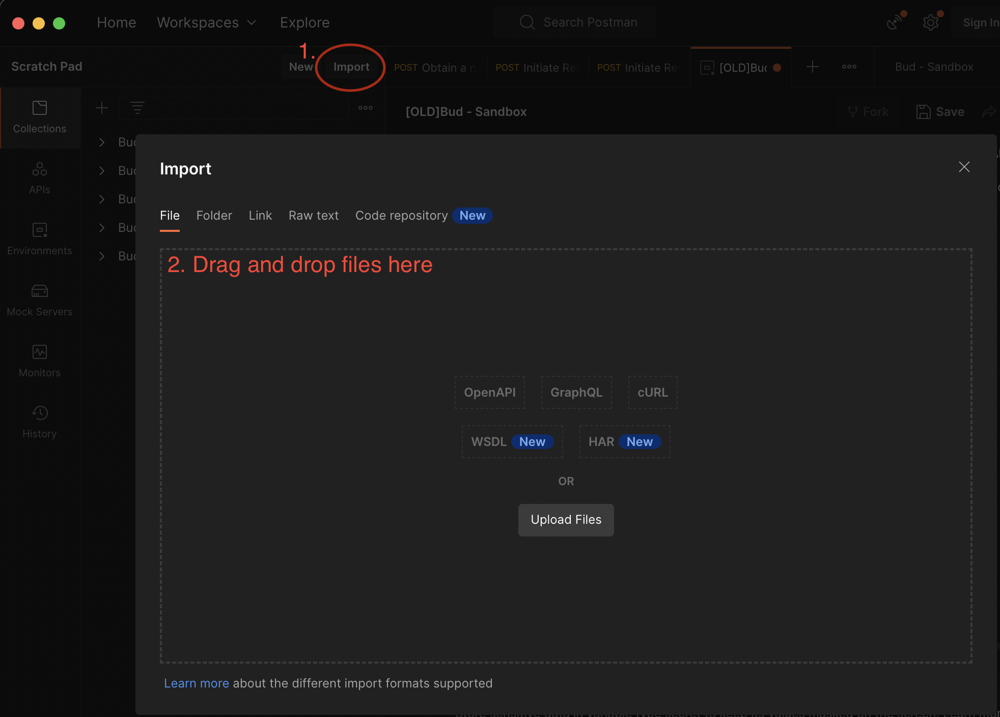
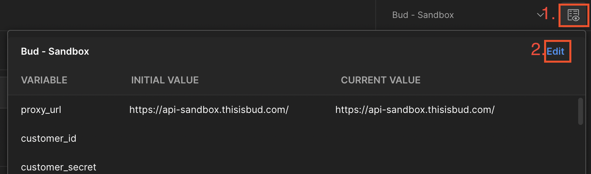
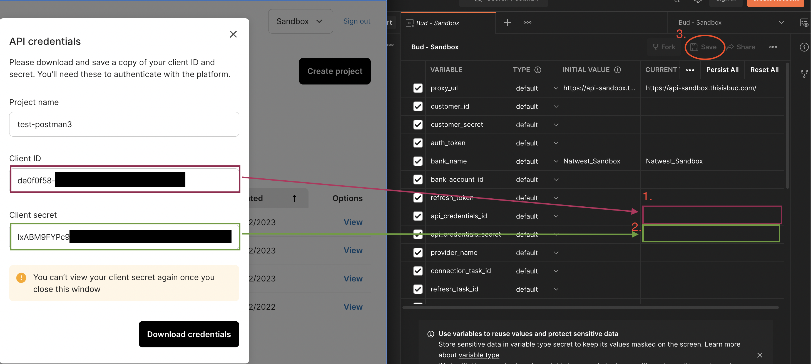
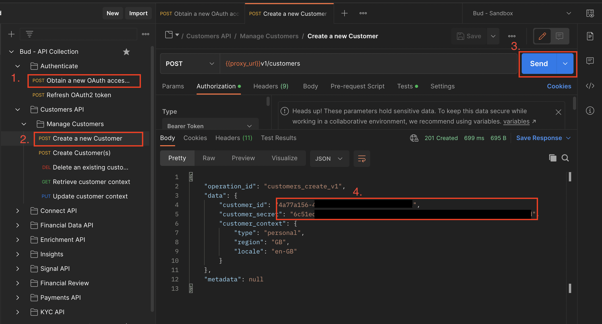

# Postman collections

If you want to get started with Bud API with no code, 
then you are at the right place.

This repo contains two API collections
- Bud - API Collection: This collection is regularly updated and contains almost all the public endpoints.
- Bud - Data enrichment flows: This collection contains endpoints in an order that you need to call them if you want to onboard with us/enrich your data using a specific flow.

## Getting started

1. First you need to have Bud API credentials
   1. Sign up [here](https://console.thisisbud.com/signup) on the portal.
   2. Once you signed up go to the projects page and click on Create Project.

   3. After creating the project you can view your API-credentials once, so make sure you download it.

2. Import postman collection
   1. You need to download the API Collection or Data enrichment flows and the Sandbox environment file as well.
   2. To import in postman you need to click on import in postman and drag the files there (see on the picture).

3. Configure postman with API credentials
   1. Select **Bud - Sandbox** environment

   2. Now you need to copy API credentials from bud console

4. Authentication with API.
   1. Select the **Obtain a new OAuth access token** request, and click on send

   2. If you performed all the previous steps you should have a valid token that is automatically saved, and you can use it for other requests.

## Obtaining customer id and secret

Some endpoints operate on customer data, for those endpoints you need `customer_id` and `customer_secret`.
Customer secret is used to encrypt customer data, you can only obtain this during customer creation.

How to obtain customer secret/ how to create a new customer

1. Get a valid token.
2. Select customers API/Manage customers/Create customer request.
3. In the request you can find the `customer_id` and `customer_secret`. These are saved as an environment variable.

## Next steps

Follow [this guide](https://docs.thisisbud.com/docs/setup-bud-banking-connections) to learn how to connect with UK banks to ingest customer financial data.

Follow [this guide](https://docs.thisisbud.com/docs/setup_data_enrichment) to learn how to get started enriching data with Bud.